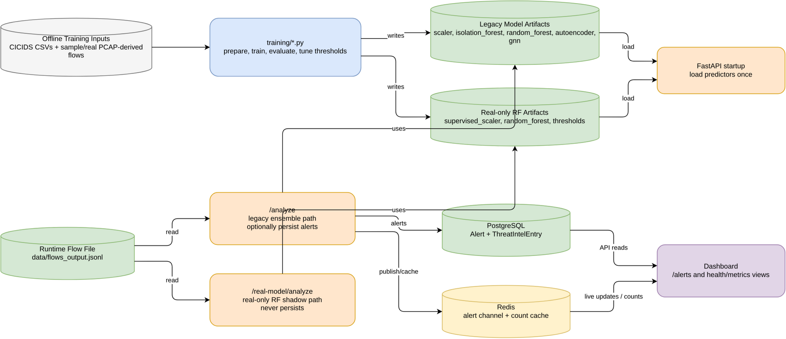

# FlowGuard Diagrams

Open `flowguard-study-diagrams.drawio` in draw.io / diagrams.net.

Useful revision order:

1. Runtime Architecture: Docker services and the main handoff points.
2. Packet To Alert Flow: what happens from PCAP input to alert display.
3. Capture Threading: producer queue consumer flow in `capture-cpp`.
4. Data And Models: training artifacts, runtime flow files, persistence, and shadow model path.

## Rendered diagrams

Each PNG embeds its Draw.io XML and remains editable.

### Runtime Architecture

### Packet To Alert Flow

### Capture Threading

### Data And Models

Skipped diagrams:

- Full file tree: already covered in `docs/app-tree.md`.
- Every Python import: too noisy for revision.
- eBPF internals: currently experimental compared with the main C++ capture path.

Code mismatches worth checking while revising:

- `ml-service/app/main.py` calls `detector.score(...)`, but `ml-service/app/ml/ensemble.py` exposes `score_flow(...)`.
- The `/metrics/model` text says a 2-of-3 ensemble, while `ensemble.py` currently votes across 4 models.
- `dashboard/src/api.js` calls `/gnn/status`, but no matching route is visible in `app/main.py`.
