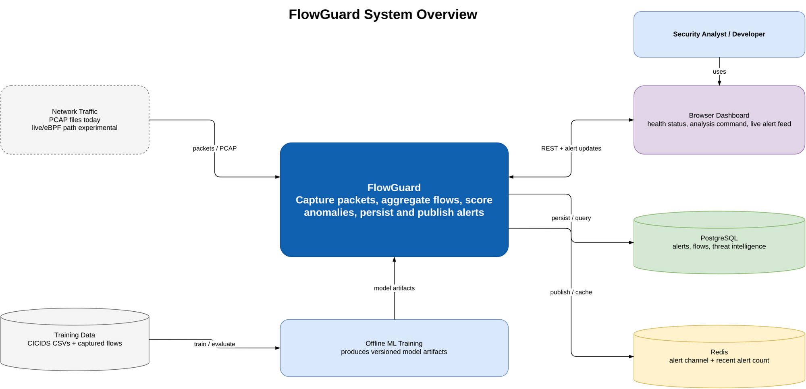
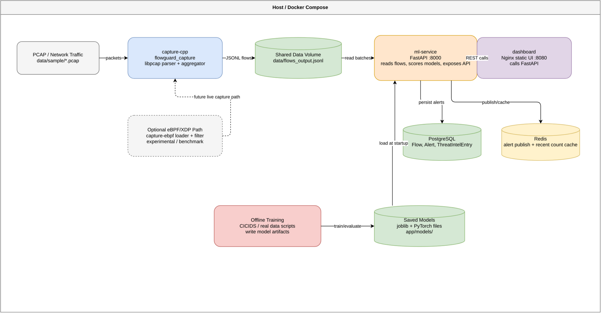
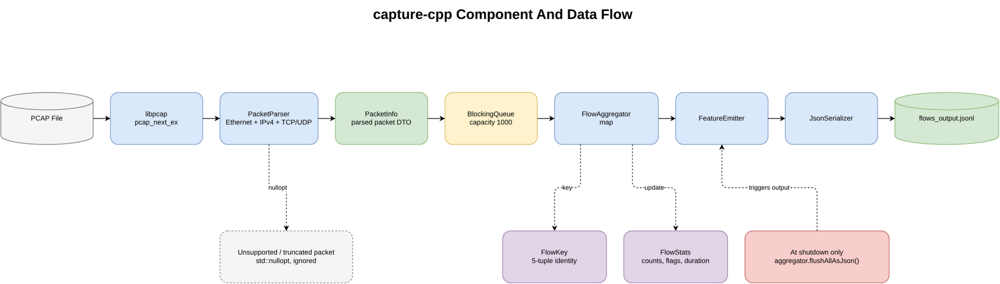
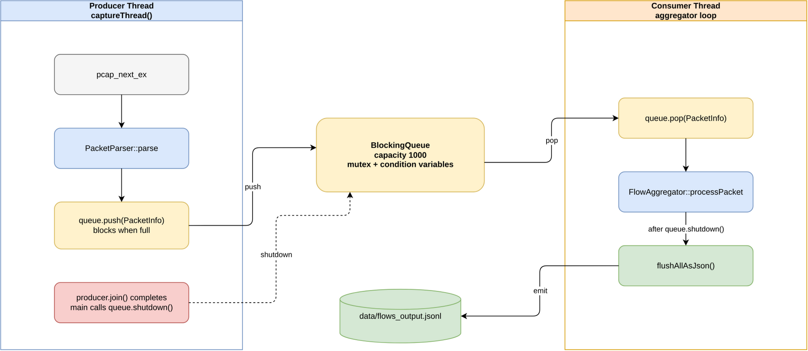
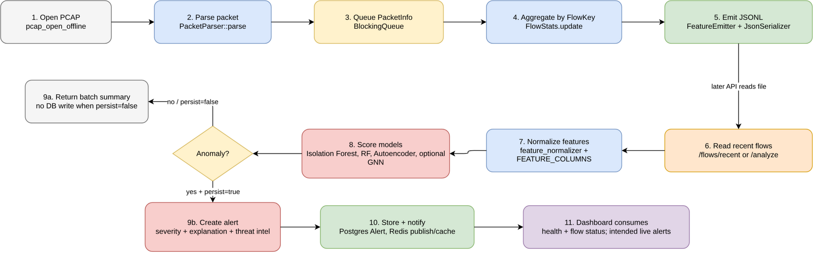
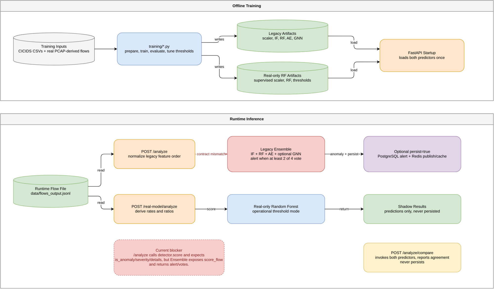
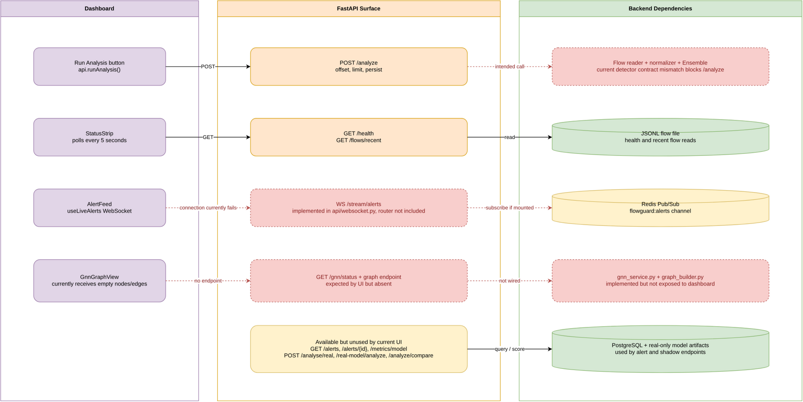
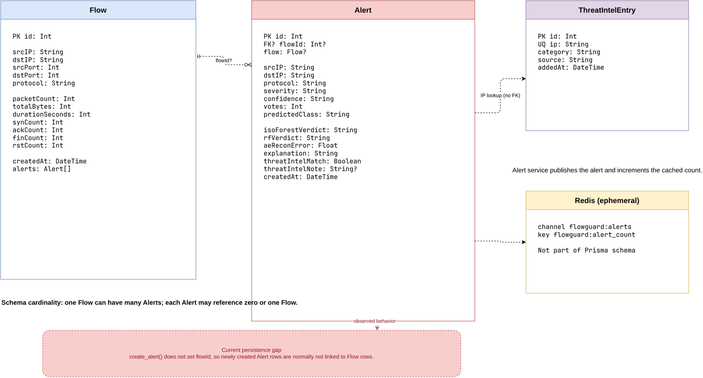

# FlowGuard Diagrams

Open `flowguard-study-diagrams.drawio` in draw.io / diagrams.net. The file
contains eight editable pages. Each rendered PNG also embeds the Draw.io XML.

Recommended revision order:

1. System Overview: project purpose, users, inputs, outputs, and dependencies.
2. Runtime Architecture: Docker services and runtime handoff points.
3. C++ Capture Components: parser, data types, queue, aggregation, and JSONL output.
4. Capture Threading: producer, bounded queue, consumer, and shutdown behavior.
5. Packet To Alert Flow: intended end-to-end processing sequence.
6. ML Training And Inference: artifacts, legacy ensemble, real-only RF, and comparison mode.
7. API And Dashboard Wiring: what is connected, available, missing, or not mounted.
8. Persistence ERD: Prisma entities, Redis data, and application-level relationships.

## System Overview

## Runtime Architecture

## C++ Capture Components

## Capture Threading

## Packet To Alert Flow

## ML Training And Inference

## API And Dashboard Wiring

## Persistence ERD

Not included:

- Full file tree: already covered in `docs/app-tree.md`.
- Every Python/JavaScript import: too noisy for revision.
- Detailed eBPF internals: experimental and not part of the primary runtime path.
